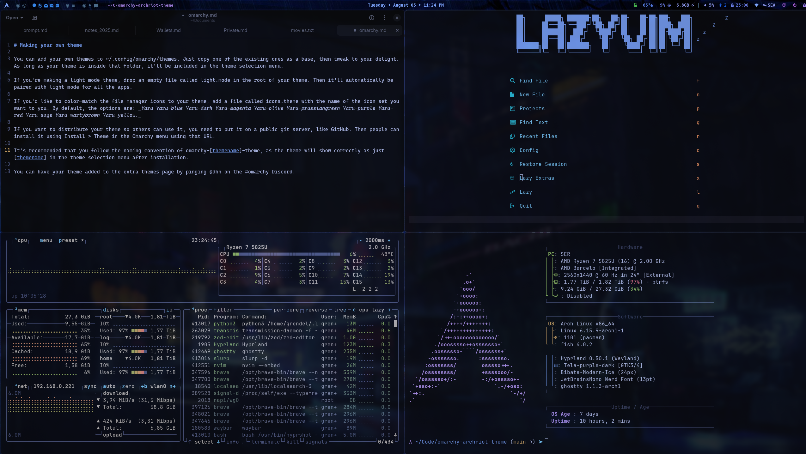

# ArchRiot Theme for Omarchy

A sleek, modern dark theme for Omarchy based on the [ArchRiot](https://archriot.org) desktop environment color palette.



## Features

- **Dark theme** with modern purple and blue accent colors
- **Complete application coverage**: Alacritty, Waybar, Hyprland, Hyprlock, Mako, Neovim, btop, SwayOSD, and Walker
- **Consistent color palette** across all components
- **Tokyo Night inspired** colors with ArchRiot's signature purple-to-blue gradients
- **High contrast** for excellent readability
- **Professional appearance** suitable for development and daily use

## Color Palette

- **Background**: Deep dark blue-gray (`#1a1b26`)
- **Secondary**: Darker blue-gray (`#222436`)
- **Accent Purple**: `#bb9af7` (primary accent)
- **Accent Blue**: `#7da6ff` (secondary accent)
- **Accent Cyan**: `#0db9d7`
- **Accent Orange**: `#ff9e64`
- **Accent Red**: `#ff7a93`
- **Green**: `#9ece6a`
- **Text**: Clean white (`#ffffff`)

## Installation

Install using Omarchy's theme installer:

```bash
omarchy-theme-install https://github.com/cyphrriot/omarchy-archriot-theme.git
```

Then select "ArchRiot" from the theme menu in Omarchy.

## Components Styled

- **Terminal**: Alacritty with Tokyo Night color scheme
- **Status Bar**: Waybar with ArchRiot color definitions
- **Window Manager**: Hyprland with purple-to-blue gradient borders
- **Lock Screen**: Hyprlock with ArchRiot styling
- **Notifications**: Mako with purple accents and transparency
- **Editor**: Neovim with Tokyo Night theme
- **System Monitor**: btop with complete ArchRiot color scheme
- **OSD**: SwayOSD with modern rounded styling
- **App Launcher**: Walker with purple highlights

## About ArchRiot

[ArchRiot](https://archriot.org) is a modern, beautiful Arch Linux desktop environment featuring cutting-edge technology and stunning visuals. This theme brings the ArchRiot aesthetic to Omarchy users.

## Credits

Created by [CypherRiot](https://github.com/cyphrriot) based on the ArchRiot desktop environment.
