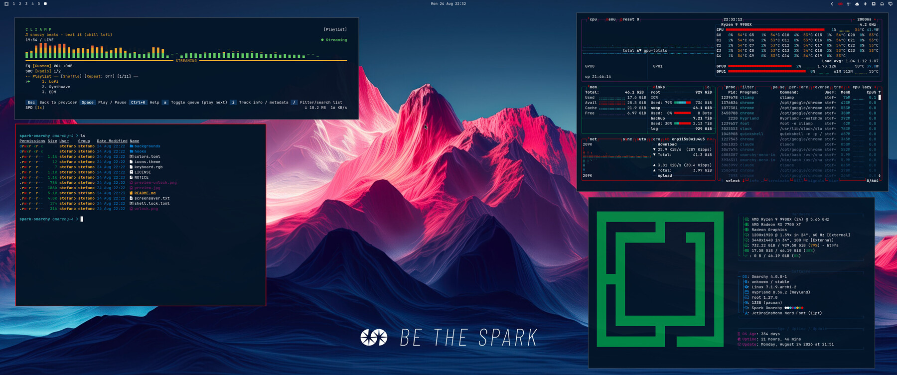

# Spark Omarchy

A corporate theme for [Omarchy](https://omarchy.org/) built on the SparkFabrik design system: Spark red on a deep navy background, with the full brand palette mapped onto the terminal and desktop.



Requires **Omarchy 4**. Everything the theme colors is derived from `colors.toml`, so the terminal, the shell (bar, notifications, launcher, lock screen), Neovim, VS Code, btop, Hyprland borders and the rest follow the same palette without any per-app files.

## Install

```bash
omarchy theme install https://github.com/stefanomainardi/spark-omarchy
```

That clones the repo into `~/.config/omarchy/themes/spark-omarchy` and applies it. To switch later, use `omarchy theme set spark-omarchy` or pick it from the theme menu.

To update:

```bash
omarchy theme update
```

## Boot and unlock screen

The theme ships its own Plymouth logo (`unlock.png`, the SparkFabrik wordmark). Apply it with:

```bash
omarchy plymouth set-by-theme spark-omarchy
```

The theme also appears in the unlock screen picker (`omarchy plymouth switcher`).

## Screensaver

The theme carries the SparkFabrik logo as screensaver art in `screensaver.txt`. Omarchy reads its screensaver art from a single global file, so a small `theme-set` hook is included to keep the art tied to the active theme: activate Spark and you get the Spark logo, switch away and the stock Omarchy logo comes back.

Install the hook once:

```bash
mkdir -p ~/.config/omarchy/hooks/theme-set.d
cp ~/.config/omarchy/themes/spark-omarchy/hooks/theme-set.d/screensaver-branding \
   ~/.config/omarchy/hooks/theme-set.d/
omarchy theme set spark-omarchy
```

Test it with `omarchy-launch-screensaver force` (press any key to dismiss).

Without the hook the theme still works, the screensaver simply keeps whatever art is already set. If you would rather not use a hook, set the logo once by hand with `omarchy branding screensaver image`.

## Backgrounds

Nine wallpapers, cycled with `omarchy theme bg next` or picked from the background switcher.

| File | Description |
| --- | --- |
| `1-spark-corporate.jpg` | Red and blue corporate design (default) |
| `2-spark-mountains.jpg` | Mountain landscape in Spark colors |
| `3-spark-abstract.jpg` | Abstract shapes in brand colors |
| `4-spark-gradient.jpg` | Clean brand gradient |
| `5-spark-mountains-a.jpg` | Mountains A, split peak with a bright core |
| `6-spark-mountains-b.jpg` | Mountains B, red and blue burst |
| `7-spark-mountains-c.jpg` | Mountains C, peak under a blue nebula |
| `8-spark-mountains-d.jpg` | Mountains D, soft red and blue split |
| `9-spark-mountains-e.jpg` | Mountains E, mountain range under a red and blue sky |

All of them are 3360x1440, framed for ultrawide displays. Extra wallpapers of your own can go in `~/.config/omarchy/backgrounds/spark-omarchy/`; they join the same cycle without touching the theme.

## Palette

### Primary

| Purpose | Hex | Name |
| --- | --- | --- |
| Spark Red | `#eb0000` | Primary brand |
| Spark Blue | `#0c335a` | Secondary brand |
| Spark Black | `#031527` | Background |
| Spark White | `#ffffff` | Text |

### Secondary

| Role | Hex | Used for |
| --- | --- | --- |
| Light Blue | `#027aca` | Links and highlights |
| Aquamarine | `#40c6cf` | Info |
| Orange | `#f36931` | Warnings |
| Yellow | `#f7ad2c` | Attention |
| Dark Green | `#008844` | Success |
| Lime | `#68d366` | Success accents |
| Dark Purple | `#8d1971` | Special elements |
| Purple | `#cd0089` | Highlights |

## What is in here

| File | Role |
| --- | --- |
| `colors.toml` | The palette. Every generated app config comes from this file |
| `shell.lock.toml` | Lock screen colors, overriding the `[lock]` section of the generated shell config |
| `icons.theme` | GTK icon theme name |
| `keyboard.rgb` | Backlight color for supported keyboards |
| `preview.jpg` | Thumbnail in the theme switcher |
| `unlock.png` | Logo for the Plymouth boot screen |
| `preview-unlock.png` | Thumbnail in the unlock screen picker |
| `screensaver.txt` | Screensaver art |
| `backgrounds/` | Wallpapers |
| `hooks/theme-set.d/` | Optional hook that scopes the screensaver art to the active theme |

To change a color, edit `colors.toml` and run `omarchy theme set spark-omarchy`. Do not add per-app config files unless you mean to override a generated one: a file shipped by the theme always wins over the generated version.

## Contributing

Issues and pull requests are welcome. If you change a color, please say which brand color it comes from.

## Credits

Theme by Stefano Mainardi, built on the SparkFabrik design system for Omarchy Linux. The theme started as a color substitution over [Catppuccin for Omarchy](https://github.com/catppuccin) and has since been rebuilt around the Omarchy 4 palette schema.

## License

The theme code and configuration are MIT licensed, see [LICENSE](LICENSE).

The SparkFabrik name, logo and wallpapers are property of SparkFabrik S.r.l. and are included here with permission. They are **not** covered by the MIT license and may not be reused to identify another product or organization. See [NOTICE](NOTICE).
